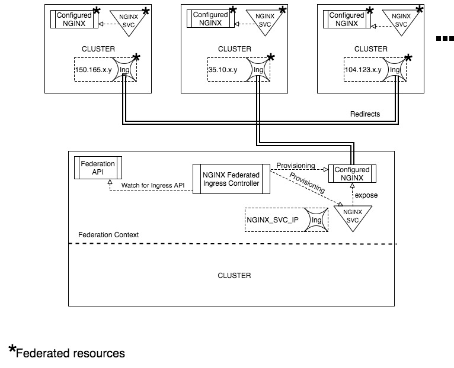

NGINX Federated Ingress
========================

**Authors:** walteraa, samanthakem, GabrielSVinha, arthur0, aembrito, marcuswac

- [Introduction](#introduction)
  - [Background](#background)
  - [Purpose](#purpose)
- [Requirements](#requirements)
  - [Functional](#functional)
  - [Availability](#availability)
  - [Extensibility](#extensibility)
- [Design](#design)
  - [Archtecture Overview](#archtecture-overview)
  - [NGINX Federated Ingress Controller](#nginx-federated-ingress-controller)
  - [Configured NGINX](#configured-nginx)
- [Future work](#future-work)

------------
Introduction
------------

### Background ###
* [Federated Ingress](https://kubernetes.io/docs/tasks/administer-federation/ingress/)
* [NGINX Ingress Controller](https://github.com/kubernetes/ingress-nginx)

### Purpose ###

The main purpose of NGINX Federated ingress controller is to provide a front-end Load balancing for each Federated Ingress, balancing the traffic among all underlying Ingress objects in every clusters underlying.

------------
Requirements
------------

### Functional ###

* The front-end LB should be a NGINX instance

* The front-end LB should have a Kubernetes Deploy for each federated Ingress in each cluster underlying. It means that the NGINX deploy for a specific Federated Ingress should be a Federated Deploy.

* The front-end LB Deploy should be exposed as a Kubernetes LoadBalancer service.

* The Kubernetes LoadBalancer service which exposes the front-end LB deploy should be federated, high availability requrirement. 

* Is mandatory has a functional Ingress Controller in every cluster underlying.

### Network Visibility ###

When specifying a multicluster envinronment, it is a requisite that the host cluster (the cluster hosting `federation-controller-manager` and `federation-api-server`) has access to the endpoints in the other cluster in the federation. You cannot map an external ip from an internal network, therefore, we assume that all Ingress created in the clusters underlying will have public IP address.

------
Design
------

### Architecture overview ###

### NGINX Federated Ingress Controller ###

This component will watch for the Federated Ingress API and react to any change in the Federated Ingresses resources. This reaction will resut exactly in a provisioning process of a [Configured NGINX](#configured-nginx) Deployment and a Service to expose this Deployment. Is important note that this resources should be federated, improving then the high availability.

The controller is responsible to map new federated Ingresses resources, therefore is also responsible for updating the front-end Load Balancer to redirect traffic to the new set of back ends(Ingresses) on each underlying cluster.

### Configured NGINX ###

This component is built in the form of a federated deployment with *n* replicas of Pods, where *n* is the number of clusters underlying the federation. The most important characteristics are:

1. The NGINX Loab Balancer does not know kubernetes resources

2. Configuration files are generated by the controller (see item above) and loaded to the NGINX, in it there will be all external IPs associated to the Ingresses in each cluster.

3. This component is generated everytime an update is done by the controller (e.g. new ip address, etc.)

4. The NGINX configuration shouldn't have any Ingress route configuration, it will be only responsible to balance the traffic among the Ingresses IPs. All routing rules is responsibility of Ingress resources.
